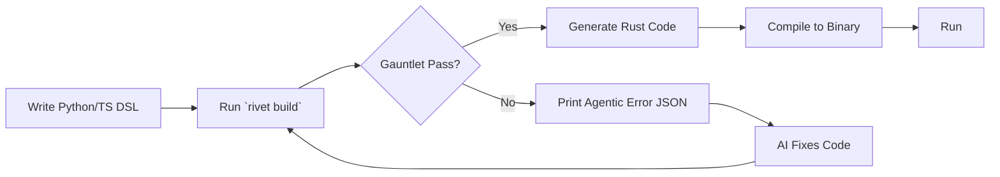

# Development Workflow



## The daily loop

Run every check before you commit. CI runs the same commands.

```bash
cargo fmt --all -- --check
cargo clippy -- -D warnings
cargo test --workspace
cargo deny check
```

## Build and audit an app

`rivet build` parses the DSL, runs the Gauntlet rules between parse and
generate, writes the crate to `generated/`, and compiles it. A rule
violation stops the build with one agentic-JSON object per finding on
stderr; warnings print and the build continues.

```bash
cargo build --release --bin rivet
./target/release/rivet build examples/basic/app.py
./examples/basic/generated/target/release/basic
```

`rivet audit` reports the MQI grade (pillar 06) for the same module. The
default output is a table; `--json` prints the machine-readable breakdown
with per-dimension scores and the `not_scored` list.

```bash
./target/release/rivet audit examples/basic/app.py
./target/release/rivet audit --json examples/basic/app.py
```

Tune the rules in the `[gauntlet]` section of `rivet.toml`:

```toml
[gauntlet]
max_complexity = 8          # E2042 threshold
stories_required = true     # set false to allow storyless routes
strict_type_checking = true # set false to skip the module-contract rule
duplicate_code = "blocker"  # outcome for E2043 (warn or block)
dead_code = "warning"       # outcome for E2044 (warn or block)
```

## Security & compliance
- RBAC enforced at compile time (zero runtime overhead).
- CVE scanning via cargo-deny runs in CI and locally with `cargo deny
  check` (see `deny.toml`).
- SSO & OAuth2 available via plugins.
- SQL Injection Prevention: sqlx compile-time query checking.
