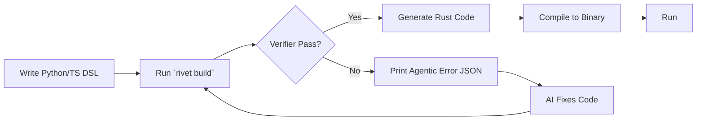

# Development Workflow



## The daily loop

Run every check before you commit. CI runs the same commands.

```bash
cargo fmt --all -- --check
cargo clippy -- -D warnings
cargo test --workspace
cargo deny check
```

## Repository self-checks (constraint tools)

The Verifier gates DSL apps; `constraint-tools/` gates the Rivet source tree
itself the same way. Three small deterministic binaries check the repo, and
`scripts/gate.sh` runs every gate in one command. Run them from the repo root:

```bash
./scripts/gate.sh                          # every gate, stops at the first failure
cargo build -p constraint-tools
./target/debug/check-file-length           # file-length ceilings
./target/debug/check-rule-modules          # rule table <-> module coherence
./target/debug/check-tracker               # tasks/ tracker coherence
```

`scripts/gate.sh` runs, in order: fmt, clippy (`-D warnings`), tests,
`cargo deny check`, the example build and audit, and the three self-checks.
It exits non-zero at the first failing stage with that stage's output
visible. CI runs the same self-checks in the `repo-self-checks` job.

### Thresholds

Each check is a small deterministic program (under 400 lines) that exits 0
or 1 and prints `path:line: message` violations. The thresholds are:

| Check | Threshold |
| :--- | :--- |
| `check-file-length` | 400 lines default; 300 for Verifier rule modules (`rivet-cli/src/verifier/*.rs` except `mod.rs`); 728/699/679/444 for four grandfathered legacy files (`parser/python.rs`, `transpiler/rust.rs`, `commands/audit.rs`, `parser/validate.rs`) that must shrink, not grow |
| `check-rule-modules` | every E-code in the Verifier module table maps 1:1 to a documented rule module |
| `check-tracker` | no `- [x]` in `tasks/todo.md`; no duplicate or cross-file task text; no open item under a `(complete ...)` section |

### How to add a check

Add one small binary under `constraint-tools/src/bin/`, auto-discovered by
cargo. Each check:

- stays under 400 lines and depends only on `std`
- takes an optional root path argument (default `.`)
- prints `path:line: message` violations, then `pass: ...` or
  `fail: N violation(s) found`
- exits 0 on pass, 1 on failure
- is deterministic: no network, randomness, or wall-clock input
- carries inline tests for its decision logic

Register long-running gates (fmt, clippy, tests, deny, example) in
`scripts/gate.sh`; register repo-wide self-checks there too and in the
`repo-self-checks` CI job (`.github/workflows/ci.yml`).

## Build and audit an app

`rivet build` parses the DSL, runs the Verifier rules between parse and
generate, writes the crate to `generated/`, and compiles it. A rule
violation stops the build with one agentic-JSON object per finding on
stderr; warnings print and the build continues.

```bash
cargo build --release --bin rivet
./target/release/rivet build examples/basic/app.py
./examples/basic/generated/target/release/basic
```

`rivet audit` reports the MQI grade (pillar 06) for the same module. The
default output is a table; `--json` prints the machine-readable breakdown
with per-dimension scores and the `not_scored` list.

```bash
./target/release/rivet audit examples/basic/app.py
./target/release/rivet audit --json examples/basic/app.py
```

Tune the rules in the `[verifier]` section of `rivet.toml`:

```toml
[verifier]
max_complexity = 8          # E2042 threshold
stories_required = true     # set false to allow storyless routes
strict_type_checking = true # set false to skip the module-contract rule
duplicate_code = "blocker"  # outcome for E2043 (warn or block)
dead_code = "warning"       # outcome for E2044 (warn or block)
```

Point `[frontend] dist` at the production frontend build to compile it into
the generated binary (pillar 03). A missing directory is a warning
(`E2004`), not a failure, so the API still builds before the frontend does:

```toml
[frontend]
dist = "dist"   # compile this directory into the binary
spa = true      # serve index.html for a client-side route
```

## Security & compliance
- RBAC enforced at compile time (zero runtime overhead).
- CVE scanning via cargo-deny runs in CI and locally with `cargo deny
  check` (see `deny.toml`).
- SSO & OAuth2 available via plugins.
- SQL Injection Prevention: sqlx compile-time query checking.
