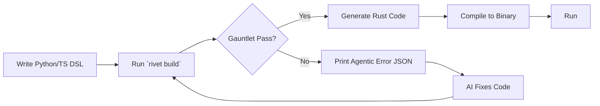

# Development Workflow

## Security & Compliance
- RBAC enforced at compile time (zero runtime overhead).
- CVE Scanning via cargo-deny integrated into the audit.
- SSO & OAuth2 available via plugins.
- SQL Injection Prevention: sqlx compile-time query checking.
