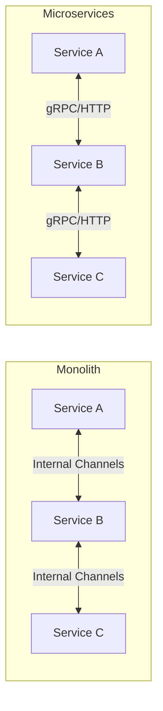

# 2. Multi-Service Architecture
Services communicate via strongly-typed internal channels. This allows zero-cost abstraction: the same code can run as a monolith (in-memory) or microservices (gRPC) by changing a single config flag.

